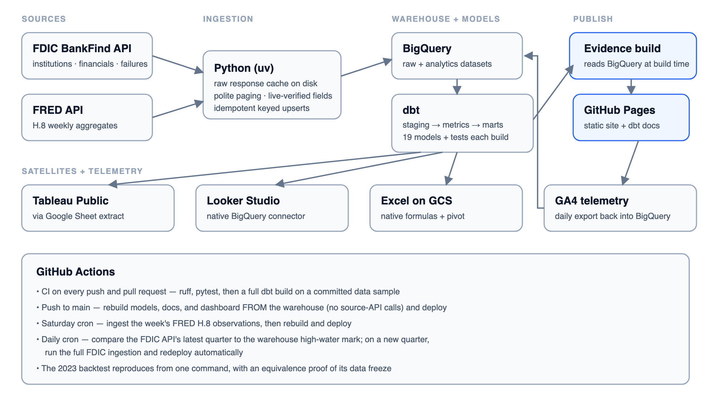

# Bank Health Monitor


I'm building an automated analytics platform on FDIC public data that tracks the
financial health of US banks: API ingestion → DuckDB/MotherDuck → dbt-tested models →
an Evidence dashboard published to GitHub Pages, refreshed on a schedule by CI.

**Live dashboard:** <https://yugveerj.github.io/fdic-bank-health-monitor/>

## Why this exists

Three of the four largest bank failures in US history happened within about eight
weeks in the spring of 2023, and the warning signs were sitting in public quarterly
filings: funding concentrated in uninsured deposits, balance sheets heavy with
rate-sensitive assets, growth that had outrun the peer group. I wanted to know
whether a straightforward peer-comparison screen, built only on the FDIC's public
data, would have surfaced those banks while it still mattered.

This repo is the answer. An automated pipeline scores every US bank above $1B in
assets against its size peers each quarter, and a point-in-time backtest freezes
the data at June 2022 and checks the 2023 failures against it. SVB ranks first in
its peer band at the freeze. First Republic doesn't, and the write-up doesn't hide
that.

## Architecture



## Results

Where the banks at the center of the 2023 banking stress ranked on my composite
screen, frozen at 2022-06-30 — nine months before the first failure. Reproduce
everything with `uv run python -m scripts.run_backtest` (it also *proves* the
freeze: a physically truncated rebuild must match the production mart exactly).

| Bank | Band | Rank in band | Band pctile | Overall (n=989) |
|---|---|---|---|---|
| Silvergate Bank (liquidated Mar 2023) | $10B–$100B | 2 / 128 | 99.2 | 8 |
| Silicon Valley Bank (failed Mar 2023) | >$100B | 1 / 35 | 100.0 | 26 |
| Signature Bank (failed Mar 2023) | >$100B | 2 / 35 | 97.1 | 60 |
| First Republic Bank (failed May 2023) | >$100B | 8 / 35 | 79.4 | 355 |
| Republic Bank (failed Apr 2024, out-of-window) | $1B–$10B | 86 / 826 | 89.7 | 95 |

Two honesty notes govern this table: the metrics were chosen with knowledge of
the 2023 events (a methodology demonstration, not an out-of-sample discovery),
and the FDIC API serves current values that may include post-2022 amendments —
the freeze is approximate. Full methodology: [docs/backtest_method.md](docs/backtest_method.md).

## Limitations

- The six screen metrics were chosen with knowledge of the 2023 events. This
  demonstrates a methodology on historical data. It is not an out-of-sample
  discovery, and I don't present it as one.
- The FDIC API serves current values, including post-2022 amendments, so the
  freeze approximates the mid-2022 view rather than reproducing it exactly.
- Three failures and one voluntary liquidation is not a sample. It's a case study,
  and the page is titled accordingly.
- Quarterly data sees the setup, not the run. SVB went from stressed to gone in
  days; no quarterly screen catches that speed.
- Peer bands are size-only. The over-$100B band puts SVB next to JPMorgan, which
  flatters nobody's comparison. Business-model peer groups are the first upgrade
  I'd make.
- The composite is an unweighted average. With three labels, fitting weights is
  how you lie to yourself, so I didn't.
- Uninsured-deposit figures are the banks' own reported estimates.

## How to run

```bash
uv sync                                        # Python env (uv installs the pinned 3.13)
uv run python -m ingestion.run_all             # full ingestion (idempotent, safe to re-run)
cd dbt && DBT_PROFILES_DIR=. uv run dbt build  # models + tests (local DuckDB by default)
cd .. && uv run python -m scripts.export_dashboard_db   # marts -> dashboard source
cd dashboard && npm run sources && npm run dev # local dashboard preview
uv run python -m scripts.run_backtest          # reproduce the 2023 backtest + proof
```

In CI the same steps run against MotherDuck (`DBT_TARGET=md`); pushes rebuild the
site from the warehouse, and only the scheduled/manual refresh re-ingests from
the FDIC API.

Copy `.env.example` to `.env` and fill in your keys — nothing secret is committed.

## What the tests caught

Two findings I'm keeping visible because they're the best argument for testing
data, not just code.

The FDIC's failures endpoint includes more than failures. It also carries
open-bank assistance records, which meant my first pass at a failure label briefly
marked Citibank and Bank of America as failed banks. The fix requires an actual
FAILURE resolution type, and a test now enforces it. Government data has semantics,
and the semantics are not always what the endpoint name says.

Winsorization saturates on zero-inflated ratios. Most smaller banks report zero
brokered deposits, which collapses the MAD and makes any nonzero bank's z-score
explode. The clamp at plus or minus five catches this, but 16% of brokered-share
rows sit exactly at the cap, which quietly erases differences between the banks
you most want to compare. The composite keeps the clamped score for stability, the
drill-down keeps an unclamped column for resolution, and the limitation is written
down instead of discovered later.

The full running log — including NULL certificate numbers on Depression-era
failure records and insured filers that aren't chartered banks — lives on the
dashboard's data-quality page and in the dbt model docs.

## Decisions

Why I made the architecture calls I made, newest first.

- **2026-07-03 — Hosting: Evidence static build on GitHub Pages.** I originally
  planned on Evidence Cloud's free tier, but it was discontinued — the managed
  product is now Evidence Studio at $15/user/mo, and it drops support for
  local-DuckDB sources. Open-source Evidence is unchanged and officially documents
  GitHub Pages as a deploy target, so my Actions workflows rebuild the static site
  on every refresh, and MotherDuck stays the warehouse the build reads at CI time.
  Before committing to this I verified interactivity survives a static build: a
  dropdown driving a parameterized query re-filters a table on the statically-served
  production bundle, with queries running client-side via DuckDB-WASM (verified with
  a scratch page before the real pages replaced it). The build is ~87 MB — only ~428 KB of it
  is query-result data, the rest is app JS including DuckDB-WASM — comfortably within
  GitHub Pages limits.

- **2026-07-03 — Python pinned to 3.13, not 3.14.** dbt-core doesn't support 3.14
  yet (its mashumaro/pydantic-v1 dependencies block it until dbt v2.0), and 3.13 is
  the newest version that dbt-core, dbt-duckdb, duckdb, and pandas all support today.
  uv downloads and pins the interpreter, so the repo doesn't depend on whatever
  Python the machine happens to have.

- **2026-07-03 — Third-party GitHub Actions pinned by commit SHA.** My first CI run
  failed because `astral-sh/setup-uv` publishes no moving `v8` major tag. The fix is
  also the safer practice: pin the exact commit SHA (with the version as a comment) —
  a SHA can't be silently retargeted the way a tag can.
