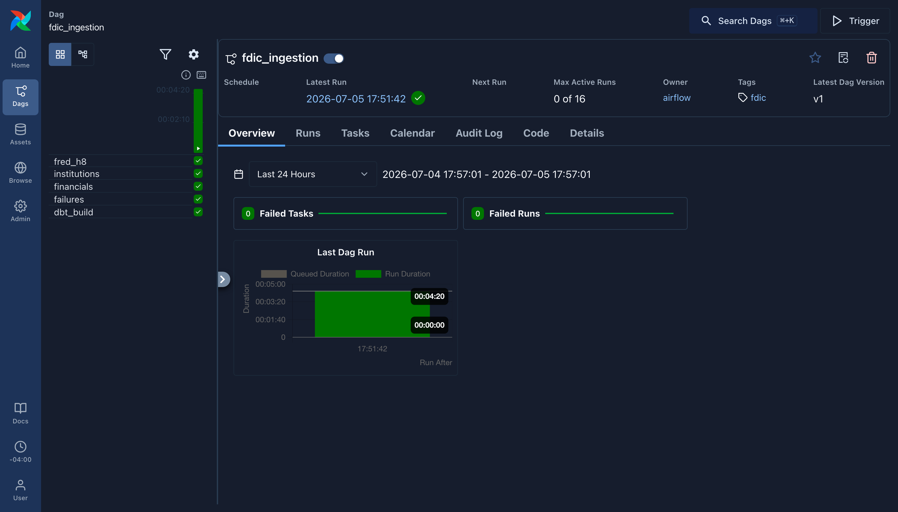

# Local Airflow

The production pipeline as an explicit Airflow DAG, run locally with
docker-compose. Production orchestration stays GitHub Actions cron — a
weekly refresh and a daily quarter check cost nothing on Actions, and an
always-on scheduler would be the most expensive component in the stack for
zero added reliability. This directory exists because the DAG *pattern*
is worth demonstrating on the same code the cron runs.

## What the DAG does

`fdic_ingestion`: the three FDIC pulls in series (one polite API client at
a time), FRED H.8 alongside, then `dbt build --target dev` once both
branches land. Same modules the production workflows call — the DAG file
contains no ingestion logic of its own.

Isolation: the compose file sets `BQ_RAW_DATASET=airflow_raw`, so the DAG
ingests into its own dataset and dbt's dev target reads from it. Nothing
here touches `fdic_raw` or the prod `analytics` dataset.

## Run it

```bash
cd orchestration
docker compose up          # postgres + airflow standalone on :8080
# wait for "Airflow is ready"; deps install at container start (~2 min)
# open http://localhost:8080 — auth is disabled for this local demo
# trigger the fdic_ingestion DAG from the UI (it has no schedule)
```

Credentials: the container mounts `~/.config/gcloud` read-only and uses
your ADC, same as local dbt. `FRED_API_KEY` is picked up from a repo-root
`.env` if present; without it the FRED task lands an empty raw table and
the build still goes green (identical to keyless local dev).

A successful run:


